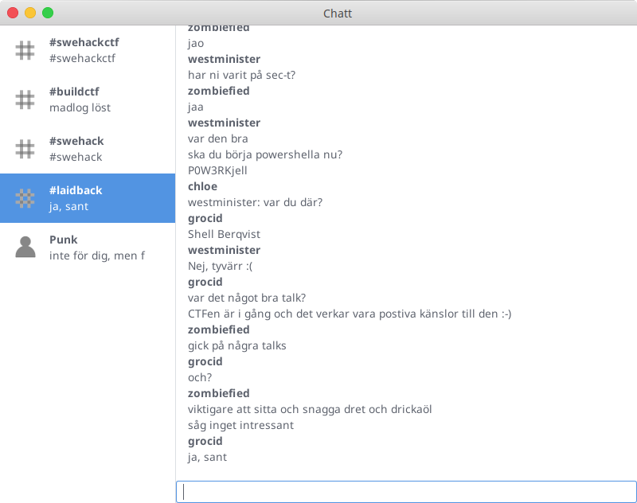
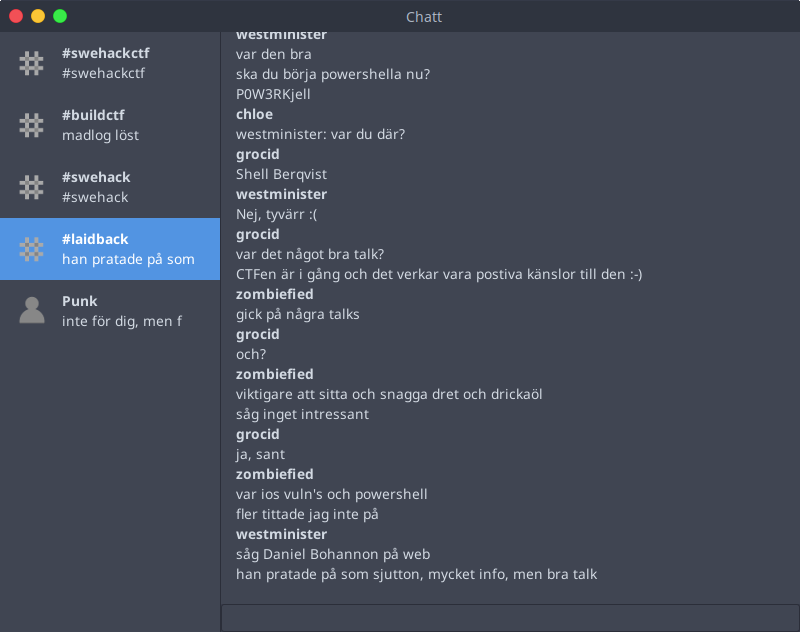
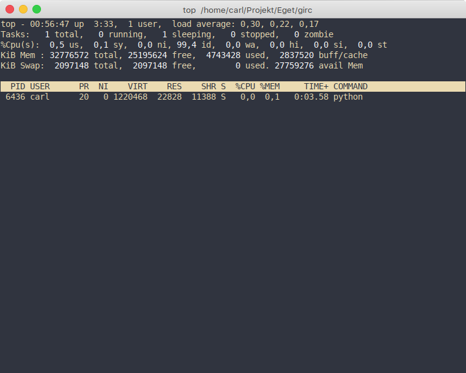

# girc
A minimal chat client in Python/Twisted. Supported commands are join `/j #channel` and part `/p`.

To configure the client, first run it in terminal:

```
$ girc configure
Server (hostname:port): myserver.org:6697
Nickname: mynick
Password: 
This will replace all entries associated with this application. Proceed [y/N]: 
```

After configuration, you can run the client as a normal GUI application.

# Screenshots

Using [macOS-Arc](https://github.com/grocid/macOS-Arc).



Using [OSX-Arc-Shadow](https://github.com/LinxGem33/OSX-Arc-Shadow).


# CPU/MEM Usage
This is running one server with four channels


# Planned
- Add some more stuff to list of planned things,